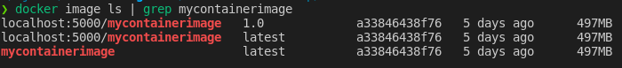

# Container Bootcamp - Section 3: Labs

### In this section we learned about:

* Dockerfiles
* Docker/Container Registries

___

## Section 3: Lab 1 - Building and Running A Container From Dockerfile

### Section 3: Lab 1 Links

* [Dockerfile Best Practices](https://docs.docker.com/engine/reference/builder/)
* [Dockerfile Full Documentation](https://docs.docker.com/engine/reference/builder/)

### Section-3: Lab 1 Content

Let's write a Dockerfile and build our own docker image locally, then we can run it.

In you the `section-3-labs` directory on your lab server, you will see a file called `Dockerfile.example`.

Copy `Dockerfile.example` to `Dockerfile` in the same folder.

Next, lets make some changes.

Since centos8 is out, lets change the first line to `FROM centos:8`

And lets make a changes to the text "Welcome to the AlphaBravo Container Bootcamp" in the default `index.html` file. Open `/ab/labs/container-bootcamp/section-3-labs/index.html` to change the text.

First, let's switch the the correct directory:

`cd /ab/labs/container-bootcamp/section-3-labs`

Now, we can build and then run this container.

`docker build -t mycontainerimage:latest .`

Once the build is complete, we can run this container image.

`docker run -itd --name mycontainer -p 80:80 mycontainerimage:latest`

Run `docker exec -it mycontainer cat /etc/os-release` to confirm it is centos:8.

Visit http://LABSERVERNAME to see your custom index file message.

Let's cleanup.

`docker rm -f mycontainer`

___

## Section 3: Lab 2 - Working with Container Registries

### Section 3: Lab 2 Links

* [Docker Hub Quickstart](https://docs.docker.com/docker-hub/)
* [Docker Tag Documentation](https://docs.docker.com/engine/reference/commandline/tag/)
* [Docker Push Documentation](https://docs.docker.com/engine/reference/commandline/push/)

### Section 3: Lab 2 Content

Docker Hub is the the most popular of the online image registries. I would encourage you to create an account at https://hub.docker.com later and try pushing images there.

**BE CAREFUL** Do not push images with private or important information to Docker Hub.

For this course, we have a registry running on the local server at http://localhost:5000. There is no pretty web interface, but it works for our purposes.

### Tagging an image for our registry

Let's retag the image we created in Lab 1 with 2 different tags. Remember, this is the same image and will not be replicated, just tagged differently. The image hash for both will be the same.:

`docker tag mycontainerimage:latest localhost:5000/mycontainerimage:1.0`

`docker tag mycontainerimage:latest localhost:5000/mycontainerimage:latest`

Run `docker image ls` to check to see that even though the tags are different, the image ids are the same `a33846438f76`. (NOTE: Your IDs may be different from the ones shown in the example, but the same as each other.)

Now, we can push that image to our local registry:

`docker push localhost:5000/mycontainerimage:1.0`

`docker push localhost:5000/mycontainerimage:latest`

Notice that the first upload takes a long time, but the second is very quick. This is because the registry recognized these were the same image and just needed to add an additional tag.

We can't visit a pretty UI to see these image in our registry, but we can query the http endpoint.

`curl -X GET http://localhost:5000/v2/_catalog`

We can see that `mycontainerimage` is listed.

Let's query to see what tags there are associated that image:

`curl -X GET http://localhost:5000/v2/mycontainerimage/tags/list`

Now, lets delete the local version of these images and run a container with the new tag. You will see the image automatically get downloaded and run.

`docker image rm localhost:5000/mycontainerimage:1.0 localhost:5000/mycontainerimage:latest`

`docker run -itd --name mycontainer -p 80:80 localhost:5000/mycontainerimage:latest`

Note the messages: 

* *Unable to find image 'localhost:5000/mycontainerimage:latest' locally*
* *latest: Pulling from mycontainerimage*

Because we deleted the images locally, they weren't available locally to run the container and they were automatically downloaded from the registry. 

Let's clean up:

`docker rm -f mycontainer && docker image prune -a -f`

___

### Congrats! You have completed the Section 3 labs. You may now proceed with the rest of the course.

